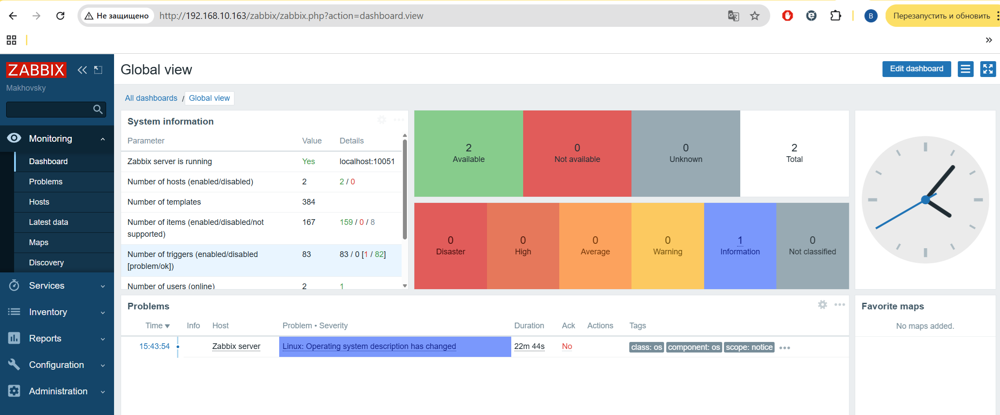
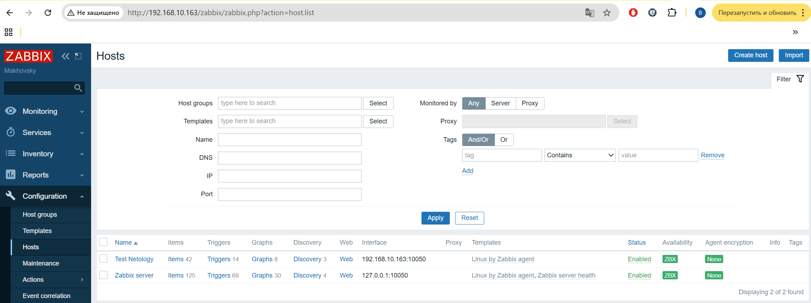
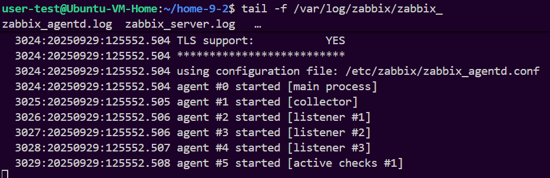
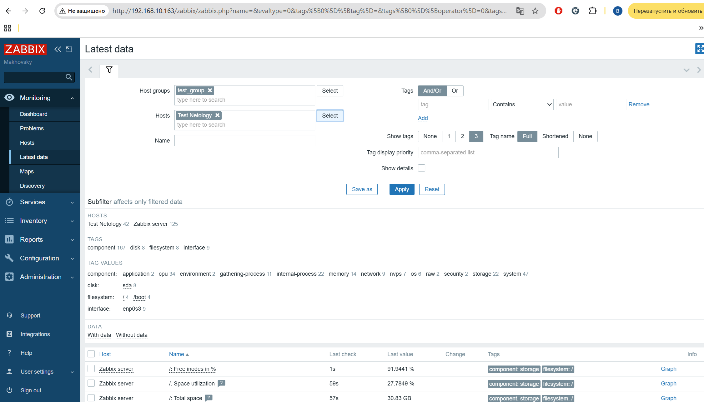

# Домашнее задание к занятию "`Домашняя работа 9-2`" - `Маховского Виктора`

---

### Задание 1

`Установите Zabbix Server с веб-интерфейсом.`
`Прикрепите в файл README.md скриншот авторизации в админке.`



`Приложите в файл README.md текст использованных команд в GitHub`
```
sudo apt update -y && sudo apt upgrade -y
sudo apt install postgresql postgresql-contrib
wget https://repo.zabbix.com/zabbix/6.0/ubuntu/pool/main/z/zabbix-release/zabbix-release_latest_6.0+ubuntu24.04_all.deb
sudo dpkg -i zabbix-release_latest_6.0+ubuntu24.04_all.deb
sudo apt update
sudo apt install zabbix-server-pgsql zabbix-frontend-php php8.3-pgsql zabbix-apache-conf zabbix-sql-scripts zabbix-agent
su - postgres -c 'psql --command "CREATE USER zabbix WITH PASSWORD '\'123456789\'';"'
su - postgres -c 'psql --command "CREATE DATABASE zabbix OWNER zabbix;"'
zcat /usr/share/zabbix-sql-scripts/postgresql/server.sql.gz | sudo -u zabbix psql zabbix
sed -i 's/# DBPassword=/DBPassword=123456789/g' /etc/zabbix/zabbix_server.conf
systemctl restart zabbix-server apache2
systemctl enable zabbix-server apache2
```
---

### Задание 2

`Установите Zabbix Agent на два хоста.`
`Приложите в файл README.md скриншот раздела Configuration > Hosts, где видно, что агенты подключены к серверу`



`Приложите в файл README.md скриншот лога zabbix agent, где видно, что он работает с сервером`



`Приложите в файл README.md скриншот раздела Monitoring > Latest data для обоих хостов, где видны поступающие от агентов данные.`



`Приложите в файл README.md текст использованных команд в GitHub`

```
sudo apt update
sudo sed -i 's/Server=127.0.0.1/Server=192.168.10.163/g' /etc/zabbix/zabbix_agentd.conf
sudo systemctl restart zabbix-agent
sudo systemctl enable zabbix-agent
```

---


